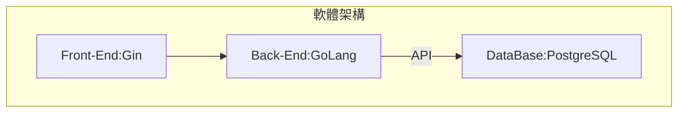

從零開始學程式（實戰Web應用Go）
===

本篇是一個總覽，會寫出動機、架構，與介紹後面篇章，並且放上最終成果在此。

[TOC]

一直以來有記錄薪水的習慣，最近正面臨工作轉換之際。剛好也想想學習一個新的後端語言，並建立一個練習Web應用，苦於找不到一個學習的目標。因此突發奇想，利用這個機會，學習如何開發一個完整的網站。因此才有了這篇文章，是做個記錄，也是留給未來的自己看看過往成長的歷程。

目標與需求
---

目標：希望建立一個Web應用
1. 利用資料庫存放個人資訊。如：自我介紹、公司、薪資、薪資結構、福利等
2. 透過後端API進行資料交互
3. 透過前端框架將頁面load出來

需要練習：
1. `cluster` or `loading balance + ngix`
2. `GoLang`目錄結構化

規格
---

### 硬體
在硬體規格挑選上，使用現有的notebook。比較特別的是選擇使用Ubuntu的OS，原因也沒什麼特別的，就是使用open source習慣了。軟體這裏就得思考了一下，因爲要建立一個Web應用，必須使用到資料庫、後端語言、前端框架。

* ACER notebook
* Processor：Intel® Core™ i7-7700HQ CPU @ 2.80GHz × 8
* Memory：16 GB
* Graphics：NVIDIA GeForce GTX 1050 Ti/PCIe/SSE2
* OS：Ubuntu 18.04 LTS

### 軟體

資料庫可以使用`PostgreSQL`、`MongoDB`；後端語言可以選擇`GoLang`、`Node.JS`;前端框架基本上是依照後端的選擇，使用該語言最熱門的框架，這樣可以少走一點冤枉路。

話不多說，先上規格：
* DataBase：`PostgreSQL`
* Back-End：`GoLang`
* Front-End：`Gin`

最終資料庫選擇`PostgreSQL`。一方面是開源的RDB，在未來在工作上使用機會可能也較多，另一方面是NoSQL的`MongoDB`過去工作已經用的比較熟悉了。所以就無腦選擇`PostgreSQL`作爲這次實驗的資料庫啦～

後端語言選擇的是`GoLang`。原因是個人比較熟悉的`Python`、`JavaScript`、`Node-Red`、`Node.JS`都是弱型別的語言。我們都知道弱型別雖然可以高速開發省去很多麻煩，但也容易遇到runtime errors，而且還特別不好除錯！也因爲是給自己的練習，所以趁這個機會，好好入手一個強型別語言，因此就挑選使用`GoLang`啦～

針對`GoLang`來選擇時下最流行的前端框架，看起來是`Gin`。剛好我也喜歡喝琴酒，作爲一個初學者，看來我是沒有選擇，因此就跟跟大家的風，來一杯82年的`Gin`吧～

> 來一個奇怪的知識點，`GoLang`的前端框架還有一個叫做`Martini`，這些阿兜仔怎麼那麼奇怪，都喜歡用酒來命名...
[GoLang 前端框架排名](https://learnku.com/articles/37364)
[GoLang 有哪一些好用的前端框架](https://www.zhihu.com/question/27370112)

任務拆解
---

* [建立`GoLang`開發環境](/jJUH3Q5gSMSbkJWe0Wce6Q)
* [利用`GoLang`建立Web應用](/MizQKhXQSh2oUDkgS1d5Rg)
* 建立`PostgreSQL`環境
* 利用`GoLang`調用DB
* 利用Gin整合
* 使用RestFul API實現調用DB(到這裏基本的網頁應該大致上成型了，再來就是開始練習結構化)
* 進階與其他應用
    * 調整架構爲Loading balance
    * 導入測試 go test
    * 開始自動化測試CI/CD
    * 加上Swagger godocs
    * 

###### tags: `Go` `GoLang` `Web` `DataBase`

go-developer-roadmap
https://github.com/eddycjy/go-developer-roadmap

Gin实践 连载一 Golang介绍与环境安装
https://segmentfault.com/a/1190000013297625

Day7 | 使用 GoLang 與資料庫進行互動
https://ithelp.ithome.com.tw/articles/10234657

Go 建立一個簡單的 web 服務
https://willh.gitbook.io/build-web-application-with-golang-zhtw/03.0/03.2

