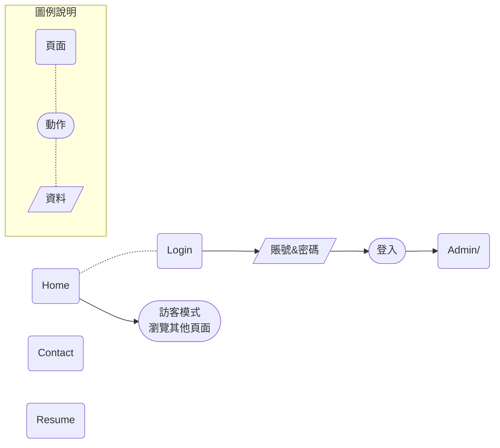

3-實戰GoLang 建立Web 應用
===

上篇簡單粗暴地實現Web 應用，實際上感覺還不夠強烈，畢竟還是複製貼上別人的代碼比較多，還不如出個題目給自己實踐一下。

針對我們的目標，會希望有個**首頁可以放些個人資訊**，有個**後臺頁面存放敏感資料**。

### 需求與目標

* 實現一個可以概覽的首頁（首頁可以放自我介紹、聯絡資訊等）
* 實現一個可登入頁面，成功登入後，跳轉後臺
* 後臺可以存放敏感資料或是管理頁面等

> 對於網站設計實在是沒什麼概念，所以找了一個範本網站來做參考。所謂程式開發...從複製、貼上開始。所以來參考一下吧～[網站設計範本](https://zh.wix.com/website/templates/html/portfolio-cv)

### SA

對於user 來說，在一個Web 應用中，最重要的無非就是**頁面**、**動作**、**資料**。因此可以針對需求結合這三個元素畫成SA，如下圖。

###### tags: `Go` `GoLang` `Web` 
