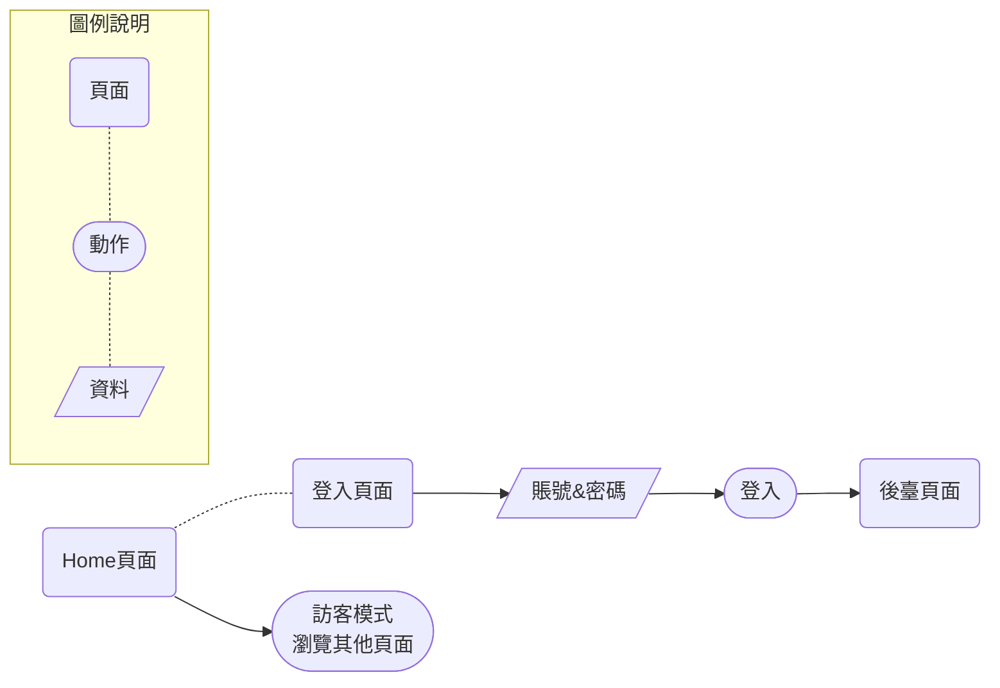

3-實戰GoLang 建立Web 應用
===

### 其他練習

練習：
* 實現一個可登入頁面，成功登入後，跳轉後臺
* 實現一個畫面

> 對於網站設計實在是沒什麼概念，所以找了一個範本網站來做參考。所謂程式開發...從複製、貼上開始。所以來參考一下吧～[網站設計範本](https://zh.wix.com/website/templates/html/portfolio-cv)

#### SA

###### tags: `Go` `GoLang` `Web` 
